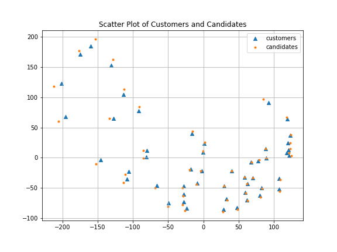
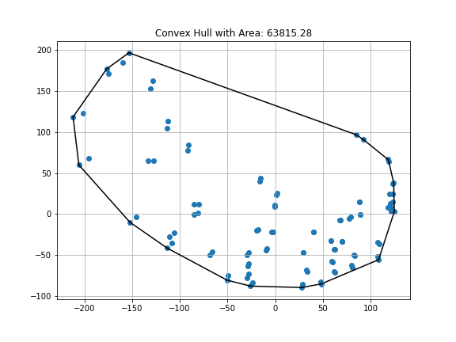

# Spatial Patterns Underlying Facility Location Problems: Visualization and Classification

## Description
The code allows visualizing spatial point patterns underlying facility location instances by inferring representative coordinates for candidates and customers in a 2-dimensional space based on the transport cost matrix. Based on these coordinates the spatial point pattern can be classified as clustered, random, or evenly distributed.

## Files
- data:
  - example.json: transport cost matrix from cap131 instance from ORLIB data set
- plots:
  - example.png: spatial point pattern estimated with GetCoordinates.py
  - example_convex_hull.png: Convex hull used to approximate the area for the hypothesis test on the underlying spatial pattern used in InferSpatial.py
- GitHub_SpatialPointPatterns.pdf: Explanation of theoretical ideas underlying the code.
- GetCoordinates.py: Class to generate coordinates via multi-dimensional scaling. 
- InferSpatial.py: Class to classify spatial point patterns based on retrieved coordinates.
- LICENSE.md 
- README.md

## Example 

The file [data/example.json](data/example.json) contains the transport cost matrix from instance cap131 from the ORLIB cap dataset available under [https://people.brunel.ac.uk/~mastjjb/jeb/orlib/capinfo.html](https://people.brunel.ac.uk/~mastjjb/jeb/orlib/capinfo.html)

Running [GetCoordinates.py](GetCoordinates.py) will provide you with coordinates producing the spatial point pattern below: 

*Notice, that the data set was originally based on a US dataset and that the spatial distribution of the points resembles the distribution of cities on a US map. However, be aware that the MDS output is not deterministic, and different random states will produce different results.*

Running [InferSpatial.py](InferSpatial.py) on the above spatial point pattern will classify the underlying spatial point pattern in the area of the convex hull as **clustered**, indicating that the average nearest neighbor distance is less than what would be expected if the points were distributed randomly. 

## Authors
- Hannah Bakker
- Stefan Nickel
